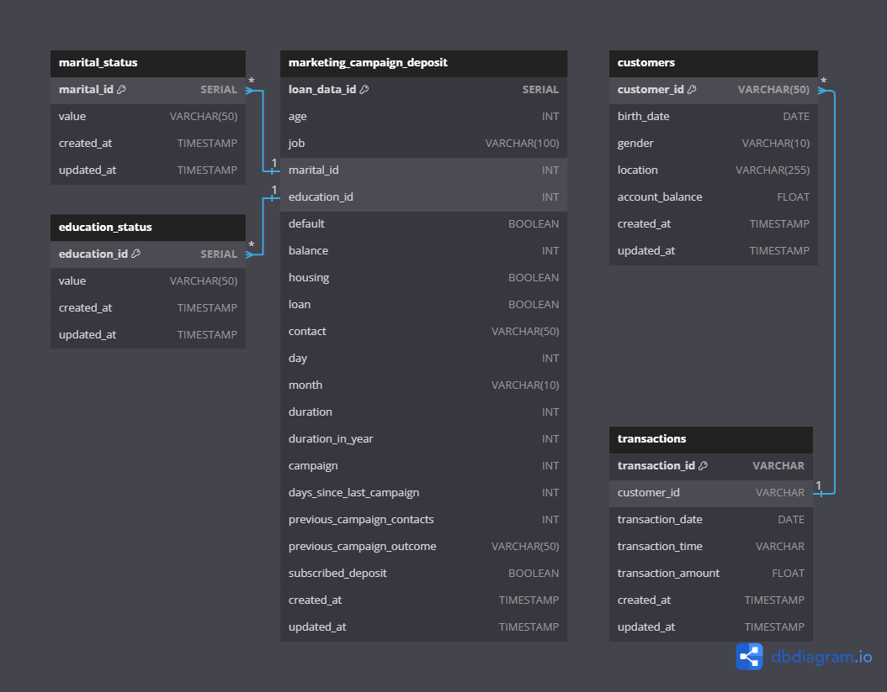
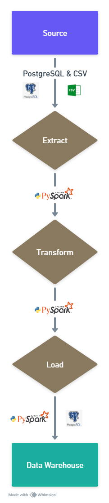

# Data Pipeline for ETL Processing

## Project Overview

This project demonstrates the implementation of a scalable data pipeline using Docker and PySpark. It integrates data from multiple sources, including a PostgreSQL transactional database and CSV files, and loads the processed data into a PostgreSQL data warehouse.

### **Tech Stack**  
The project is built using the following technologies and tools:  

- **PySpark** – For handling large-scale data processing.  
- **PostgreSQL** – Source transactional database and target data warehouse.  
- **Docker & Docker Compose** – For containerized environment management.  
- **Jupyter Notebook** – For data exploration and validation.  
- **Logging** – To track pipeline execution and errors using python.

## Table of Contents

1. [Project Overview](#project-overview)
2. [Prerequisites](#prerequisites)
3. [Setup Instructions](#setup-instructions)
4. [Running the Project](#running-the-project)
5. [Dataset](#dataset)
6. [Requirements Gathering](#requirements-gathering)
7. [Problem Statement](#problem-statement)
8. [Solution Approach](#solution-approach)
9. [Data Pipeline Design](#data-pipeline-design)
10. [Data Processing Steps](#data-processing-steps)
    - [Extract](#extract)
    - [Transform](#transform)
    - [Load](#load)
11. [Logging](#logging)

## Prerequisites

Before you begin, ensure you have met the following requirements:
- Docker installed on your local machine

## Setup Instructions

1. Clone the repository to your local machine.
   ```bash
   git clone https://github.com/hudiyaresa/PySpark-ETL-Banking-Transactions
   cd PySpark-ETL-Banking-Transactions
   ```

2. Navigate to the project directory.
3. Run the Docker Compose setup.

## Running the Project

To build and run the project, execute the following commands in your terminal:

```bash
docker compose build --no-cache
docker compose up -d
```

After the containers are up and running, if the required libraries and dependencies are not installed, install them manually:

```bash
docker exec -it pyspark_container pip install sqlalchemy psycopg2-binary
```

To access Jupyter Notebook on the PySpark container, check the container logs to get the token:

```bash
docker logs pyspark_container
```

Example output:
```bash
http://127.0.0.1:8888/lab?token=3fa3b1cf2c67643874054971f23ee59bdee283b373794847
```

## Dataset

### 1. Source Database (`source_db` container)
- A PostgreSQL database containing structured [marketing campaign data](https://github.com/hudiyaresa/PySpark-ETL-Banking-Transactions/source/init.sql).

### 2. CSV File (`/script/data/new_bank_transaction.csv`)
- A [large dataset](https://github.com/hudiyaresa/PySpark-ETL-Banking-Transactions/script/data/new_bank_transaction.csv) containing transactional records.
- Requires transformation before loading into the Data Warehouse.

### 3. Warehouse Database (`data_warehouse` container)
- A PostgreSQL database containing structured schema [data warehouse](https://github.com/hudiyaresa/PySpark-ETL-Banking-Transactions/warehouse/init.sql) Tables include `customers`, `transactions`, `marketing_campaign_deposit`, `education_status` and `marital status`.




## Data Exploration

Before building the data pipeline, you must first explore and understand the dataset.
[A Jupyter Notebook](/script/notebook.ipynb) is provided in `/script/notebook.ipynb` to facilitate data exploration. This notebook includes:
- Checking the number of rows and columns.
- Identifying missing values.
- Basic statistical analysis of the dataset (re-check the results).


## Requirements Gathering

To understand the needs and requirements of stakeholders, below is a simulation of an interview =

#### **1. What is the main purpose of this PySpark ETL pipeline?**  
**Stakeholder Answer:** The pipeline is designed to manage and process large-scale banking transaction data from multiple sources, including a PostgreSQL database and CSV files. The goal is to transform and load this data into a structured data warehouse for analysis. PySpark is used to handle big data efficiently.  

#### **2. What are the main data sources for this pipeline?**  
**Stakeholder Answer:** The pipeline integrates data from two main sources:  
   - A PostgreSQL **source database** containing structured transactional data.  
   - CSV files with bulk banking transactions that require transformation before loading into the data warehouse.  

#### **3. How should the extracted data be structured in the data warehouse?**  
**Stakeholder Answer:** The data warehouse follows a predefined schema based on the **Source-to-Target Mapping Document**. Data needs to be standardized, transformed, and aligned with the warehouse schema before loading.  

#### **4. Are there any refinements or transformations needed before storing the data?**  
**Stakeholder Answer:** Yes, several transformations are required to improve data quality and consistency, including:  
   - **Data Type Adjustments**: Convert numeric columns to appropriate formats (e.g., string to integer, float to decimal).  
   - **Currency Standardization**: Remove "$" signs and ensure numerical consistency.  
   - **Date Refinements**: Convert transaction timestamps into `YYYY-MM-DD HH:MM:SS` format.  
   - **Gender Normalization**: Convert "M" → "Male", "F" → "Female", null → "Other".  
   - **Column Renaming**: Adjust column names for consistency.  

#### **5. How should the pipeline handle missing values, particularly in gender, location, and account balance?**  
**Stakeholder Answer:** Missing values should be retained to prevent data loss. However, we need to:  
   - Assign **"Other"** for missing gender data.  
   - Keep `NULL` values in **location and account balance** while notifying operations to update customer records.  
   - Ensure that all **date values are valid** (e.g., replacing `1/1/1880` with a reasonable default).  

#### **6. Should we enforce validation checks before loading data?**  
**Stakeholder Answer:** Yes, key validation checks include:  
   - Standardizing **gender values** (e.g., M → Male, F → Female).  
   - Ensuring **transaction timestamps** use the correct format (`HH:MM:SS`).  
   - Checking **account balances** for negative or invalid values.  
   - Validating **customer age** to avoid unreasonable birth years.  
   - Ensured that no dates exceed the current year (`<= 2025`).  

#### **7. What are the expected volumes of data, and how frequently should the pipeline run?**  
**Stakeholder Answer:**  
   - **Daily ingestion** of new CSV files containing **millions of transactions**.  
   - The database is updated in **real-time**, so the pipeline should process incremental changes **daily** to avoid performance issues.  

#### **8. How should we handle transaction amounts stored as strings with currency symbols?**  
**Stakeholder Answer:**  
   - Remove **"$" symbols** and convert values to decimal format.  
   - Ensure **consistent rounding rules** for financial accuracy.  

#### **9. Should we truncate target tables before loading new data?**  
**Stakeholder Answer:**  
   - For full reloads, truncate tables before inserting new data.  
   - For incremental loads, use an **append strategy** to avoid data loss.  

#### **10. Should we log pipeline execution details?**  
**Stakeholder Answer:** Yes, logging should capture:  
   - **Extracted row counts** from both sources.  
   - **Transformation summaries**, including removed duplicates.  
   - **Load success/failure messages**.  
   - Errors for debugging.  


## Problem Statement

1. Data is spread across multiple sources (PostgreSQL and CSV files).
2. Large file sizes can impact computational efficiency.
3. Data is not in a structured format suitable for analysis.

## Solution Approach

- Implement an **ETL (Extract, Transform, Load) pipeline** using PySpark.
- Use Docker to containerize services (PySpark, PostgreSQL Source DB, and Data Warehouse).
- Standardize and clean data before inserting it into the warehouse.
- Automate logging for tracking pipeline execution.

## Data Pipeline Design

A structured ETL pipeline is implemented with the following steps:




### Source to Target Mapping

A predefined transformation process ensures smooth data movement from the source database and CSV files to the data warehouse. Refer to the [Source-to-Target Mapping Documentation](https://github.com/hudiyaresa/PySpark-ETL-Banking-Transactions/source-to-target-map.md) for details.


## Data Processing Steps

### Extract
- Extract data from the source PostgreSQL database and CSV files.
- Uses `spark.read.csv("data/{filename}", header=True)` for CSV extraction.

### Transform
The transformation process is handled by multiple PySpark scripts:

#### **1. [casting_data.py](script/transform/process/casting_data.py)** – **Casting Data Types**
- Ensures columns have the correct data types.
- Example transformations:
  - Converts the `balance` column from string (with currency symbols) to integer.
  - Converts `transaction_amount` and `account_balance` to double.
  - Converts `duration_in_year` by dividing `duration` (days) by 365 and rounding the result.

#### **2. [clean_data.py](script/transform/process/clean_data.py)** – **Data Cleaning**
- Standardizes and cleans column values.
- Example transformations:
  - **Customers Table:** Converts `customer_gender` values:
    - `M` → `Male`
    - `F` → `Female`
    - Any other value → `Other`
  - Trims whitespace and converts text to lowercase for consistency.

#### **3. [convert_date.py](script/transform/process/convert_date.py)** – **Date Format Conversion**
- Ensures dates and times are in a standard format.
- Example transformations:
  - Converts `transaction_date` from `d/M/yy` format to `YYYY/MM/DD`.
  - Transforms `transaction_time` from `HHMMSS` to `HH:MM:SS`.
  - Corrects `CustomerDOB` (Date of Birth) by assuming:
    - If the last two digits of the year are greater than 25, it belongs to the 1900s (`19YY`).
    - Otherwise, it belongs to the 2000s (`20YY`).

#### **4. [rename_columns.py](script/transform/process/rename_columns.py)** – **Renaming Columns**
- Standardizes column names across different data sources.
- Example mappings:
  - **Customers Table:**
    - `CustomerID` → `customer_id`
    - `CustomerDOB` → `birth_date`
    - `CustGender` → `gender`
  - **Transactions Table:**
    - `TransactionID` → `transaction_id`
    - `TransactionDate` → `transaction_date`
  - **Marketing Campaign Table:**
    - `pdays` → `days_since_last_campaign`
    - `previous` → `previous_campaign_contacts`

#### **5. [select_columns.py](script/transform/process/select_columns.py)** – **Selecting Relevant Columns**
- Ensures only necessary columns are included in the final dataset.
- Example selections:
  - **Customers Table:** Includes `customer_id`, `birth_date`, `gender`, `location`, `account_balance`.
  - **Transactions Table:** Includes `transaction_id`, `customer_id`, `transaction_date`, `transaction_time`, `transaction_amount`.

### Load
- Inserts transformed data into the PostgreSQL Data Warehouse.
- Uses the `append` method to maintain historical records.

## Logging
All logs generated during the execution of the data pipeline are saved in the following file:

```plaintext
/script/log/log.info
```

